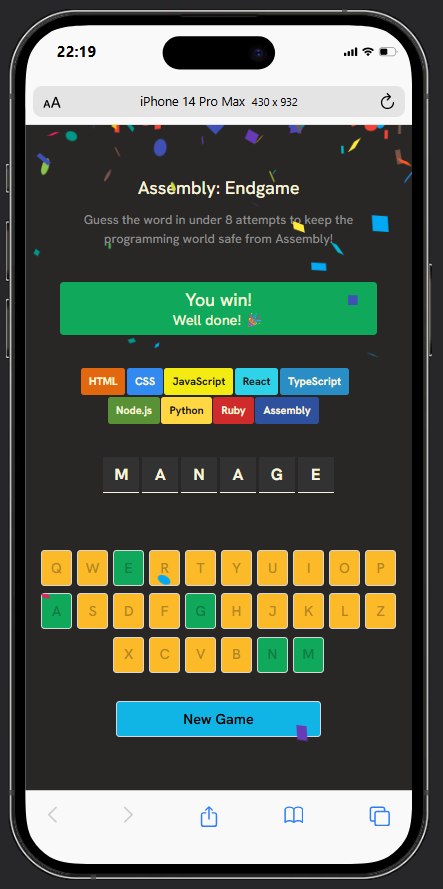

# Assembly: Endgame 🎮

A Hangman-inspired word guessing game built with **React**. Your goal is to guess the hidden word before all programming languages are eliminated.

## Preview

Try to reveal every letter before you run out of attempts. Each incorrect guess removes one programming language from the list, and the game ends after eight wrong guesses.

## Features

* 🎯 Random word generation
* ⌨️ Interactive on-screen keyboard
* 🎨 Dynamic button and language status styling
* 💬 Random farewell messages after incorrect guesses
* 🏆 Win and lose game states
* 🔄 Start a new game instantly
* ⚛️ Built with modern React using Hooks

## Technologies Used

* React
* JavaScript (ES6+)
* CSS
* HTML5
* Vite
* clsx

## How to Play

1. A random word is selected.
2. Click letters on the keyboard to make guesses.
3. Correct guesses reveal letters in the word.
4. Incorrect guesses eliminate one programming language.
5. Guess the entire word before eight incorrect guesses to win.

## What I Learned

While building this project, I practiced:

* React state management with `useState`
* Conditional rendering
* Array methods (`map`, `filter`, `every`, `includes`)
* Dynamic CSS class handling with `clsx`
* Component rendering and game logic
* Creating reusable utility functions

## Future Improvements

* Prevent duplicate letter guesses
* Add keyboard support for physical keyboards
* Display game statistics
* Add difficulty levels
* Add animations and sound effects
* Store high scores using Local Storage
* Improve accessibility

## License

This project is for learning and personal development purposes.
